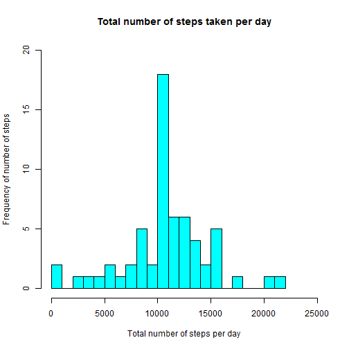

# Reproducible Research: Peer Assessment 1

The variables included in this dataset are:

* steps: Number of steps taking in a 5-minute interval (missing values are coded as NA)
* date: The date on which the measurement was taken in YYYY-MM-DD format
* interval: Identifier for the 5-minute interval in which measurement was taken


## Loading and preprocessing the data


* **Load the data (i.e. read.csv())**


```r
activity <- read.csv(unz("activity.zip","activity.csv"))
str(activity)
```

```
## 'data.frame':	17568 obs. of  3 variables:
##  $ steps   : int  NA NA NA NA NA NA NA NA NA NA ...
##  $ date    : Factor w/ 61 levels "2012-10-01","2012-10-02",..: 1 1 1 1 1 1 1 1 1 1 ...
##  $ interval: int  0 5 10 15 20 25 30 35 40 45 ...
```

```r
summary(activity)
```

```
##      steps               date          interval   
##  Min.   :  0.0   2012-10-01:  288   Min.   :   0  
##  1st Qu.:  0.0   2012-10-02:  288   1st Qu.: 589  
##  Median :  0.0   2012-10-03:  288   Median :1178  
##  Mean   : 37.4   2012-10-04:  288   Mean   :1178  
##  3rd Qu.: 12.0   2012-10-05:  288   3rd Qu.:1766  
##  Max.   :806.0   2012-10-06:  288   Max.   :2355  
##  NA's   :2304    (Other)   :15840
```
 


## What is mean total number of steps taken per day?

* **Make a histogram of the total number of steps taken each day**


```r
activity.steps.day <- aggregate(steps ~ date, activity, sum)

hist(activity.steps.day$steps,  col = "cyan",  main = "Total number of steps taken per day", 
     xlab = "Number of steps per day", ylab = "Frequency of number of steps", breaks = 20, 
     xlim= c(0,25000),ylim= c(0,10) )
```

 

* **Calculate and report the mean and median total number of steps taken per day**


```r
#calculate the mean
steps.mean <- mean(activity.steps.day$steps,na.rm = TRUE)
steps.mean
```

```
## [1] 10766
```

```r
#calculate the median
steps.median <- median(activity.steps.day$steps,na.rm = TRUE)
steps.median
```

```
## [1] 10765
```

The mean of total number of steps taken per day is **1.0766 &times; 10<sup>4</sup>**

The median of total number of steps taken per day is **10765**


## What is the average daily activity pattern?

* **Make a time series plot (i.e. type = "l") of the 5-minute interval (x-axis) and the average number of steps taken, averaged across all days (y-axis)**


```r
activity.steps.interval <- aggregate(steps ~ interval, activity, mean)
plot(activity.steps.interval$steps, type = "l", main = "Average daily activity",
     xlab = "5-minute interval", ylab = "Average number of steps ")
```

 

* **Which 5-minute interval, on average across all the days in the dataset, contains the maximum number of steps?**


```r
max.interval <- activity.steps.interval[which.max(activity.steps.interval$steps),]$interval
max.interval
```

```
## [1] 835
```

The 5-minute interval containing he maximum number of steps is **835**


## Imputing missing values

* **Calculate and report the total number of missing values in the dataset (i.e. the total number of rows with NAs)**


```r
na.numbers <- sum(is.na(activity))
na.numbers
```

```
## [1] 2304
```

The total number of missing values in the dataset is **2304**


* **Devise a strategy for filling in all of the missing values in the dataset.**

The strategy is to fill the missing values with the average of each 5-minute interval per day

* **Create a new dataset that is equal to the original dataset but with the missing data filled in.**


```r
filled.activity <- merge(activity, activity.steps.interval, by = "interval", suffixes = c("", ".mean"))
nas <- is.na(filled.activity$steps)
filled.activity$steps[nas] <- filled.activity$steps.mean[nas]
filled.activity <- filled.activity[, c(1:3)]
```

* **Make a histogram of the total number of steps taken each day and Calculate and report the mean and median total number of steps taken per day. Do these values differ from the estimates from the first part of the assignment? What is the impact of imputing missing data on the estimates of the total daily number of steps?**


```r
filled.steps.day <- aggregate(steps ~ date, data = filled.activity, FUN = sum)

hist(filled.steps.day$steps, col = "cyan", main = "Total number of steps taken per day", 
     xlab = "Total number of steps per day", ylab = "Frequency of number of steps", 
     breaks = 20, xlim= c(0,25000),ylim= c(0,20))
```

 


```r
filled.steps.mean <- mean(filled.steps.day$steps)
filled.steps.mean
```

```
## [1] 10766
```

```r
filled.steps.median <- median(filled.steps.day$steps)
filled.steps.median
```

```
## [1] 10766
```

The mean of total number of steps taken per day with imputing missing values is **1.0766 &times; 10<sup>4</sup>**

The median of total number of steps taken per day imputing missing values is **1.0766 &times; 10<sup>4</sup>**


There is not a lot of differences on mean and median with or without missing values.
The impact of the missing data is low, on the estimates of the total daily number of steps.


## Are there differences in activity patterns between weekdays and weekends?

* **Create a new factor variable in the dataset with two levels - "weekday" and "weekend" indicating whether a given date is a weekday or weekend day.**


```r
Sys.setlocale("LC_TIME", "English")
```

```
## [1] "English_United States.1252"
```

```r
day.type <- function(date) {
    if (weekdays(as.Date(date)) %in% c("Saturday", "Sunday")) 
        "weekend"
    else 
        "weekday"
}
filled.activity$daytype <- as.factor(sapply(filled.activity$date, day.type))
```


* **Make a panel plot containing a time series plot (i.e. type = "l") of the 5-minute interval (x-axis) and the average number of steps taken, averaged across all weekday days or weekend days (y-axis)**


```r
activity.means <- aggregate(steps ~ interval + daytype, data=filled.activity, mean)

library(lattice)
xyplot(steps ~ interval | daytype, data = activity.means, type = "l", layout = c(1, 2), 
       main="Activity between weekdays and weekends", xlab = "5-minute interval" , 
       ylab = "Average number of Steps")
```

 


The maximum average number of steps during weekdays is higher than that during the weekend.But, on average, there are more activities during the weekend. 

